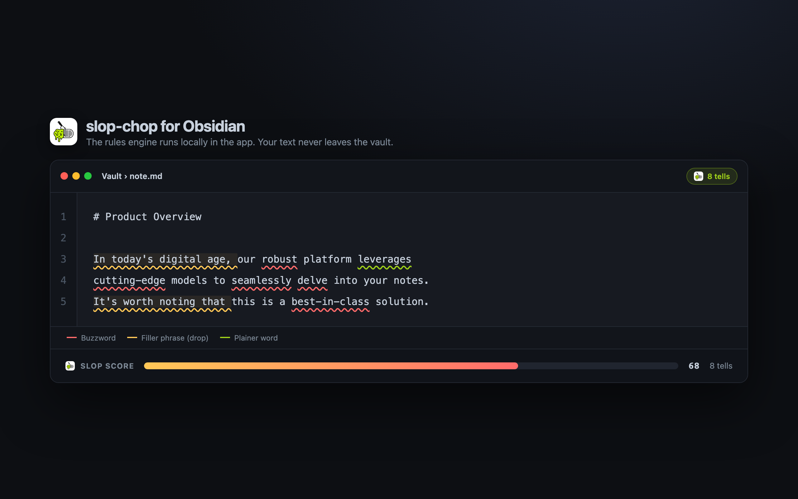
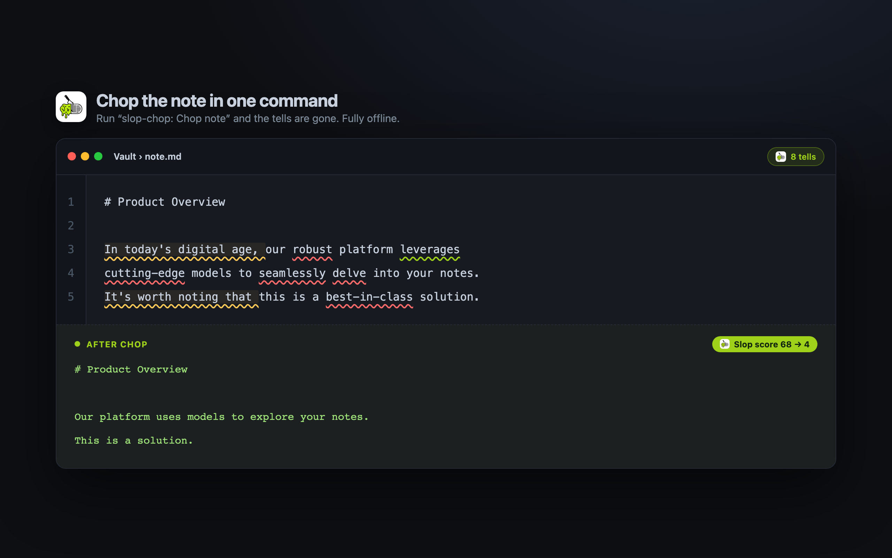

# slop-chop for Obsidian

Chop AI writing tells from your notes. The rules engine runs locally in the app as
WebAssembly, so your text never leaves the vault. Deterministic: the same note gives the same
result every time.

Part of [slop-chop](https://slop-chop.com). This repo holds the packaged plugin; the source
lives in the [main repo](https://github.com/dcadolph/slop-chop/tree/main/obsidian).

## Use

- **Chop note** — the scissors ribbon icon, or the "slop-chop: Chop note" command, rewrites the
  active note in place.
- **Chop selection** — chops the selected text, or the whole note when nothing is selected.
- **Settings** — set the preset and your voice: keep, prefer, and avoid. They apply to every
  chop.

Each chop shows the slop score before and after.

## Install

Once it is in the community catalog: Settings, Community plugins, Browse, search "slop-chop".

Manual: download `manifest.json` and `main.js` from the latest release into
`<vault>/.obsidian/plugins/slop-chop/`, then enable it under Community plugins.

Desktop only. MIT licensed.
